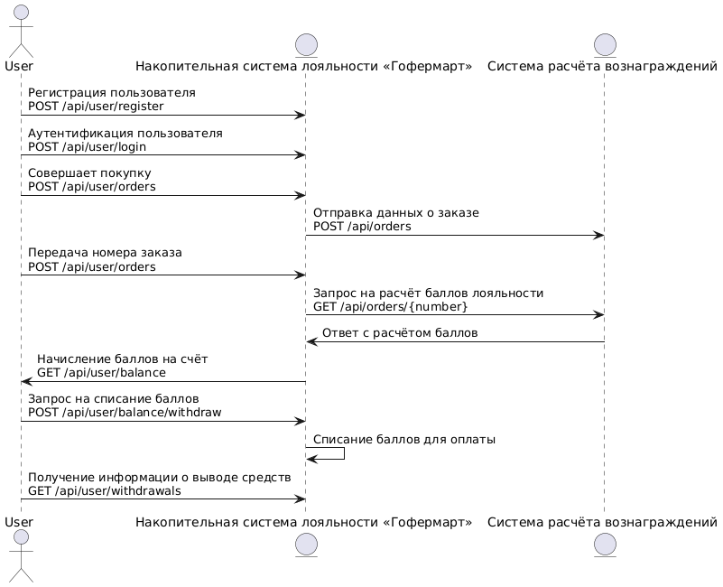

# API для накопительной системы лояльности "Гофермарт"

Этот проект предоставляет HTTP API для управления накопительной системой лояльности и системой расчёта баллов. API делится на два компонента:

1. **Накопительная система лояльности** (работа с пользователями и их баллами)
2. **Система расчёта баллов** (расчёт вознаграждений за совершённые покупки)

## Абстрактная схема взаимодействия с системой

## API накопительной системы

1. **Регистрация пользователя**
   - `POST /api/user/register`
   - Описание: Регистрирует нового пользователя.
   - Параметры запроса:
     - `login`: Логин пользователя
     - `password`: Пароль пользователя

2. **Аутентификация пользователя**
   - `POST /api/user/login`
   - Описание: Аутентификация пользователя по логину и паролю.
   - Параметры запроса:
     - `login`: Логин пользователя
     - `password`: Пароль пользователя

3. **Загрузка номера заказа для расчёта**
   - `POST /api/user/orders`
   - Описание: Загружает номер заказа для дальнейшего расчёта баллов лояльности.
   - Параметры запроса:
     - `order_number`: Номер заказа

4. **Получение списка загруженных заказов**
   - `GET /api/user/orders`
   - Описание: Получает список загруженных пользователем номеров заказов, статусы их обработки и информацию о начислениях.

5. **Получение текущего баланса**
   - `GET /api/user/balance`
   - Описание: Получает текущий баланс счёта баллов лояльности пользователя.

6. **Запрос на списание баллов**
   - `POST /api/user/balance/withdraw`
   - Описание: Запрашивает списание баллов с накопительного счёта для оплаты нового заказа.
   - Параметры запроса:
     - `order_number`: Номер заказа
     - `points`: Количество баллов для списания

7. **Получение информации о выводах**
   - `GET /api/user/withdrawals`
   - Описание: Получает информацию о выводах средств (баллов) с накопительного счёта пользователя.

## API системы расчёта баллов

1. **Получение информации о расчёте начислений баллов**
   - `GET /api/orders/{number}`
   - Описание: Получает информацию о расчёте начислений баллов лояльности для конкретного заказа.
   - Параметры запроса:
     - `{number}`: Номер заказа

2. **Регистрация нового совершённого заказа**
   - `POST /api/orders`
   - Описание: Регистрирует информацию о новом заказе в системе расчёта баллов.

3. **Регистрация новой механики вознаграждения за товар**
   - `POST /api/goods`
   - Описание: Регистрирует информацию о новой механике вознаграждения за товар (например, новые правила начисления баллов).

---

